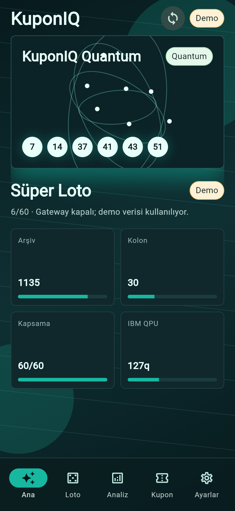
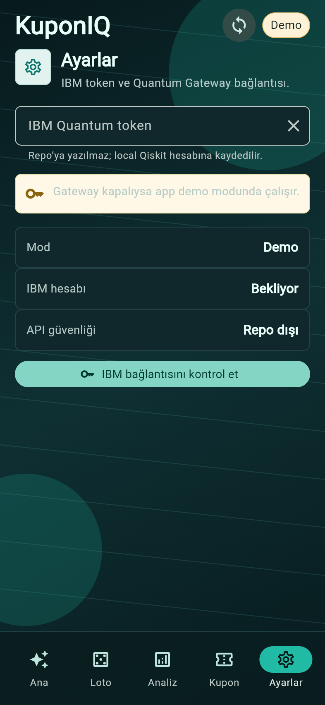

# Quantum Lotto Lab

High-qubit IBM Quantum lottery research toolkit for configurable lotteries.

This project builds lottery ticket sets from historical draw data, classical statistical features, and optional IBM Quantum sampling. It is designed for research, education, and experimentation.

**It does not guarantee winnings. Lottery outcomes are random.**

## Motto

Every random process has mathematics. This tool does not assume that the math is exploitable; it tests whether measured structure survives calibrated null tests and out-of-sample validation.

## What It Does

- Asks which lottery and which draw date you want.
- Loads historical draws from a built-in source or your own CSV.
- Checks data quality before modeling: duplicate dates, range errors, repeated numbers, and draw sizes.
- Supports lotteries with different formats, not only 6-number games.
- Builds mathematical features:
  - frequency, recency, exponential recency, and Bayesian-smoothed frequency
  - overdue/gap behavior and anti-frequency controls
  - pair and triple co-occurrence lift
  - serial lag overlap, runs-test anomalies, entropy deficit, and distribution drift
  - month/weekday seasonality checks
  - historical backtest summary
  - theoretical jackpot and 2+/3+ baselines
- Runs a 15-model walk-forward validation suite before selecting the ticket weighting model.
- Calibrates randomness fingerprints against synthetic uniform draw histories, so raw pair/triple lift does not become a fake signal.
- Separates historical fit from nested predictive validation, where every tested draw is unseen during ticket generation.
- Can run exact top-K candidate search when the combination space is feasible, including `C(60, 6) = 50,063,860`.
- Optimizes multi-column ticket sets for coverage, overlap control, pair/triple diversity, and historical 2+/3+ backtest behavior.
- Forces full union coverage when the column capacity can cover the full pool, such as `30 x 6 >= 60` for `6/60`.
- Optionally runs a real IBM Quantum job using 100-200 qubits when the selected backend supports it.
- Uses IBM QPU bitstrings as a high-qubit sampling signal for ticket generation, with `standard`, `long`, `deep`, and `extreme` profiles.

## Built-In Lottery Specs

Run:

```bash
quantum-lotto-lab list
```

Current built-ins:

- `powerball` - US Powerball, `5/69 + 1/26`
- `mega-millions` - US Mega Millions, `5/70 + 1/25`
- `euromillions` - EuroMillions, `5/50 + 2/12`
- `eurojackpot` - EuroJackpot, `5/50 + 2/12`
- `super-loto-tr` - Turkey Super Loto, `6/60`
- `cilgin-sayisal-loto-tr` - Turkey Çılgın Sayısal Loto, `6/90 + 2/90`
- `sans-topu-tr` - Turkey Şans Topu, `5/34 + 1/14`
- `on-numara-tr-draw` - Turkey On Numara draw audit field, `22/80`
- `uk-lotto` - UK Lotto, `6/59 + bonus`
- `france-loto` - France Loto, `5/49 + 1/10`
- `germany-6aus49` - Germany Lotto 6aus49, `6/49 + superzahl`
- `superenalotto` - Italy SuperEnalotto, `6/90`

Some jurisdictions publish clean CSV/API data; others change websites frequently or have licensing constraints. For reliable runs, use `--csv` with a draw-history file.

## Install

```bash
git clone https://github.com/analistboracetinkaya-sudo/quantum-lotto-lab.git
cd quantum-lotto-lab
python3 -m venv .venv
source .venv/bin/activate
python -m pip install -e ".[dev]"
```

## Quick Start Without IBM Quantum

Recommended workflow: audit first, generate second.

```bash
quantum-lotto-lab audit \
  --lottery powerball \
  --date 2026-06-23 \
  --columns 30 \
  --target portfolio30 \
  --output outputs/powerball_audit.json
```

```bash
quantum-lotto-lab predict \
  --lottery powerball \
  --date 2026-06-23 \
  --columns 30 \
  --output outputs/powerball.json
```

With your own CSV:

```bash
quantum-lotto-lab predict \
  --lottery super-loto-tr \
  --date 2026-06-23 \
  --csv examples/sample_draws.csv \
  --columns 30
```

## IBM Quantum Setup

The repository does **not** contain API keys.

Each user saves their own IBM Quantum token locally:

```bash
quantum-lotto-lab ibm-login
```

The Flutter app can also save a token through the local gateway. Start the
gateway, open Ayarlar, paste the IBM Quantum token, and use the local save
action. The token is written to the user's Qiskit account storage, not to this
repository.

Then run:

```bash
quantum-lotto-lab audit \
  --lottery powerball \
  --date 2026-06-23 \
  --columns 30 \
  --ibm \
  --quantum-profile long \
  --backend ibm_kingston \
  --output outputs/powerball_ibm.json
```

If the backend has fewer available qubits than requested, Qiskit/IBM constraints apply. Use `ibm_kingston`, `ibm_marrakesh`, or another backend available to your IBM account. The `long` profile requests a substantially heavier run than the old short defaults: 127 requested qubits, 64 layers, 12 batch circuits, 8192 shots per circuit, and 2 repeat jobs before backend limits.

## CSV Format

Recommended:

```csv
date,numbers,bonus
2025-01-01,"1 5 9 21 33 44",7
```

For fixed-column games:

```csv
date,1,2,3,4,5,6
2025-01-01,1,5,9,21,33,44
```

## Custom Lotteries

Create a JSON spec:

```json
{
  "slug": "my-lottery",
  "name": "My Custom Lottery",
  "region": "Custom",
  "main": { "name": "numbers", "min": 1, "max": 60, "pick": 6 },
  "bonus": { "name": "bonus", "min": 1, "max": 12, "pick": 2 }
}
```

Run:

```bash
quantum-lotto-lab predict \
  --spec examples/custom_lottery.json \
  --date 2026-06-23 \
  --csv examples/sample_draws.csv
```

## What "Quantum" Means Here

The IBM mode submits a real high-qubit circuit to IBM Quantum hardware. Exact classical statevector simulation scales as `O(2^qubits)`, so a 100-200 qubit circuit is not something a normal computer can exactly simulate.

That does **not** mean it predicts lottery outcomes. It means the ticket-generation system can use a real quantum measurement distribution as part of the research workflow.

The locked workflow is:

1. Validate the draw history.
2. Test whether historical draws deviate from a simple random baseline.
3. Fingerprint the **kind** of randomness: frequency bias, entropy compression, pair/triple clustering, temporal memory, runs irregularity, distribution drift, calendar effects, gap anomaly, and graph concentration.
4. Calibrate those fingerprints against synthetic uniform histories.
5. Run 15 walk-forward candidate models against the uniform baseline.
6. Run nested predictive validation so tested draws are unseen during ticket generation.
7. Generate candidate variations using sampled search or exact top-K search when feasible.
8. Select either the best single 6-number column or a diversified 30-column 6/6 portfolio.
9. Optionally add IBM Quantum sampling as the final entropy/sampling layer using a long/deep/extreme profile.

The walk-forward model suite currently includes:

```text
uniform, frequency_all, recent_frequency, ewma_recency,
bayesian_dirichlet, gap_overdue, pair_centrality,
anti_frequency, anti_recent, drift_recent_vs_old, stability,
hybrid_gap_pair, hybrid_recency_pair, ensemble, legacy_weighted
```

See [docs/methodology.md](docs/methodology.md) for the plain-language math notes.

## Security Notes

- Do not commit IBM tokens.
- Do not put tokens in `.env` files inside public repositories.
- This tool uses Qiskit's local account storage through `quantum-lotto-lab ibm-login`.
- Generated output files and counts are ignored by `.gitignore`.

## Turkey Data And Mobile Prototype

Turkey-specific product metadata lives in `quantum_lotto_lab/tr_lotteries.py`.
Use the fetcher to build reproducible local CSVs and a data-quality manifest:

```bash
PYTHONPATH=. python scripts/fetch_tr_lottery_data.py --output-dir data/tr --years 10
```

Current generated files include:

- `data/tr/cilgin_sayisal_loto_tr_10y.csv`
- `data/tr/super_loto_tr_10y.csv`
- `data/tr/sans_topu_tr_10y.csv`
- `data/tr/on_numara_tr_10y_undated.csv`
- `data/tr/turkey_lottery_manifest.json`

The Flutter app is under `app/` and is branded as **KuponIQ Quantum**.
It contains a 5-tab mobile workflow: Ana, Loto, Analiz, Kupon, and Ayarlar.
Only IBM Quantum token setup lives under Ayarlar; there is no public prototype
user profile or membership screen.

## Mobile Screenshots




The Ayarlar tab only handles IBM Quantum token/gateway status; there is no
profile or membership flow in the public prototype.

The local gateway is under `server/kuponiq_gateway/`:

```bash
python -m pip install -e ".[server]"
uvicorn server.kuponiq_gateway.app:app --host 127.0.0.1 --port 8787
```

The app never commits user credentials. IBM execution is controlled by the
Python gateway, which reads or writes the user's local Qiskit account on that
machine. Production token storage should use platform secure storage or a
backend-controlled IBM runtime session.

## Development

```bash
python -m pip install -e ".[dev]"
pytest
```

## License

MIT
