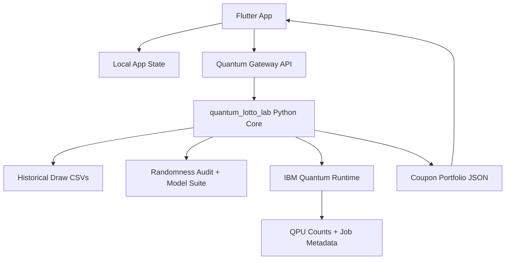

# KuponIQ Quantum App Implementation Plan

Status: local-only plan. Do not push until the app is reviewed and secrets are verified clean.

## Product Goal

Build a polished Flutter mobile app that lets a user choose a lottery, sync/audit historical data, run the randomness model, optionally submit IBM Quantum sampling through the user's own IBM account, and prepare coupon portfolios with clear risk metrics.

The app must never present generated coupons as guaranteed winning numbers. It presents them as mathematical risk-optimization outputs.

## Non-Negotiables

- IBM API tokens are never committed.
- Public repo must not contain user credentials, job tokens, generated private outputs, or local `.env` files.
- Flutter UI must be usable without IBM by showing demo/offline mode.
- IBM mode must use real IBM Quantum runtime through the Python gateway, not a fake in-app random generator.
- Prediction execution remains user-triggered; the app should not silently run paid/limited IBM jobs.

## Architecture

## Local Secret Strategy

During local development, IBM credentials are read by the Python gateway from one of these local-only sources:

1. Qiskit account storage created by `quantum-lotto-lab ibm-login`.
2. `.env.local` ignored by git.
3. OS keychain/secure storage in a later mobile build.

The Flutter app stores only local connection preferences. It must not persist a raw IBM token in committed source.

## App Screens

1. Welcome
   - Product identity, short value proposition, responsible-use message.
2. Sign In
   - Local demo profile first.
   - Future membership provider slot.
3. IBM Connection
   - Token status, backend availability, last job id.
   - Button: connect/check IBM account.
4. Lottery Picker
   - Turkish games first: Süper Loto, Çılgın Sayısal Loto, Şans Topu, On Numara.
   - Later: US/EU games from existing specs.
5. Data Health
   - Draw count, last draw date, excluded rows, range validation.
6. Randomness Fingerprint
   - Human-readable randomness type: near-uniform, drift-heavy, pair-clustered, gap-heavy, etc.
   - Frequency, recency, entropy, pair/triple, calendar and drift cards.
7. Quantum Job Setup
   - Backend, qubits, layers, batch circuits, shots, profile.
   - Cost/limit warning and explicit run button.
8. Job Monitor
   - Queued/running/done/error state.
   - Job ids and backend metadata.
9. Coupon Builder
   - Column count, target coverage, overlap limit, risk mode.
   - Generate locally or with IBM counts.
10. Portfolio Result
   - Coupon list, union coverage, 2+/3+ backtest rates, zero-hit risk.
   - Export/share-ready coupon summary.

## Implementation Phases

### Phase 1 - App Shell And Visual System

- Replace the single-file prototype with feature folders.
- Add a clean Material 3 theme with restrained premium styling.
- Build reusable widgets:
  - metric card
  - lottery tile
  - quantum job status pill
  - number ball row
  - risk chart strip
  - primary action footer
- Keep responsive layouts for mobile and web preview.

### Phase 2 - Data Models And Mock Flow

- Add Dart models for:
  - lottery game
  - data health summary
  - randomness fingerprint
  - IBM backend/job status
  - coupon portfolio
- Add a local fake repository so every screen works before the gateway is wired.
- Add widget tests for the main flow.

### Phase 3 - Python Quantum Gateway

- Add a local FastAPI gateway under `server/`.
- Gateway endpoints:
  - `GET /health`
  - `GET /lotteries`
  - `GET /lotteries/{slug}/data-health`
  - `POST /audit`
  - `POST /ibm/backends`
  - `POST /ibm/run`
  - `GET /ibm/jobs/{job_id}`
  - `POST /portfolio`
- Gateway calls the existing `quantum_lotto_lab` package.
- Gateway reads IBM credentials only from local ignored storage.

### Phase 4 - Flutter Gateway Integration

- Add HTTP client layer in Flutter.
- Add timeout/error states.
- Show offline/demo fallback if gateway is not running.
- Keep IBM run action explicit and visible.

### Phase 5 - Real IBM Run Path

- Wire IBM backend listing.
- Submit a controlled long profile job using existing Python `ibm.py`.
- Save job metadata under ignored local `outputs/`.
- Feed IBM counts into the coupon optimizer.

### Phase 6 - IBM Token Settings Layer

- Keep public prototype account-free.
- Add only an IBM token/settings section.
- Store tokens outside git through Qiskit local account storage or secure storage.

### Phase 7 - QA And Push Gate

- Run:
  - `python -m ruff check .`
  - `pytest -q`
  - `flutter analyze`
  - `flutter test`
  - secret scan with token patterns
- Confirm no IBM token, local output, or `.env.local` is tracked.
- Commit locally.
- Push only after user explicitly approves.

## First Build Target

The first implementation should produce a usable local MVP:

- Beautiful Flutter UI with the 10-screen flow.
- Demo data visible without a backend.
- Gateway health check wired.
- Lottery list and data health pulled from Python.
- IBM status screen ready, but real QPU execution behind a separate explicit button.

## Practical Constraint

Flutter/Dart should not reimplement Qiskit. IBM Quantum execution belongs in the Python gateway. This keeps the mobile app clean and keeps the existing mathematical engine as the source of truth.
